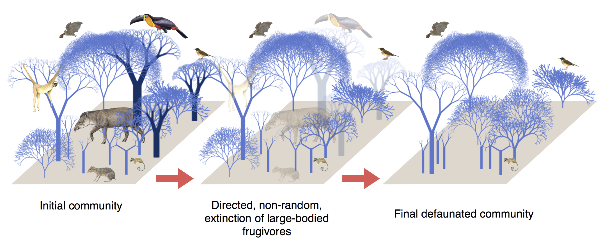

# MS_Carbon
Supplemental information, code, and data for the MS: 
Carolina Bello, Mauro Galetti, Marco A. Pizo, Luiz Fernando S. Magnago, Mariana Ferreira Rocha , Renato A. F. Lima, Carlos A. Peres, Otso Ovaskainen, and Pedro Jordano (2015). Defaunation impacts carbon storage in tropical forests.

*Summary*:
Carbon storage is widely acknowledged as one of the most valuable forest ecosystem services. Deforestation, logging, fragmentation and climate change have significant impacts on tropical carbon stocks, however an elusive and yet undetected decrease in carbon storage may be due to defaunation of large seed dispersers. Many large tropical trees with sizeable contributions to carbon stock rely on large vertebrates for seed dispersal and regeneration, yet many of these frugivores are threatened by hunting, illegal trade and habitat loss. We used a large dataset on tree species composition and abundance, seed, fruit and carbon related traits, and plant-animal interactions to estimate the loss of carbon storage capacity of tropical forests in defaunated scenarios. By simulating the local extinction of trees that depend on large frugivores at 31 Atlantic Forest communities, we found that defaunation has the potential to significantly erode carbon storage even when only a small proportion (10%) of large-seeded trees are extirpated.

This is the code and dataset for the defaunation simulations function `simulation7porcA` with one example community of the Atlantic Forest. The aim is to see how carbon stock will change in the defaunated scenario (loss of tree species with seed size >= 12.0 ± 1.1 mm) and, in the random extinction scenario (i.e., tree species removal independent of seed size).

The inputs are the community data merged with the trait data `prove_community.csv` and, with the initial cabon `carbon_proxi` already calculated. The code presents the function, explaining each step. Then, we apply it to the community data (here we use just one community but it can be applied to the 31 communities in the same way). Finally the code produces a diagnostic plot of the carbon balance, illustrating the trend for the local community in the scenarios of random extinction of tree species and of directed extinction of trees deopendent upon large-bodied frugivores.
